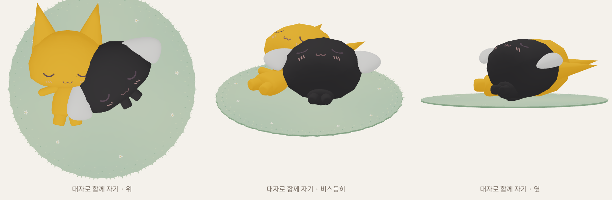
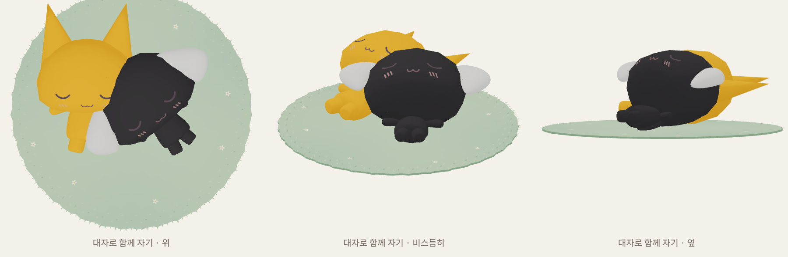
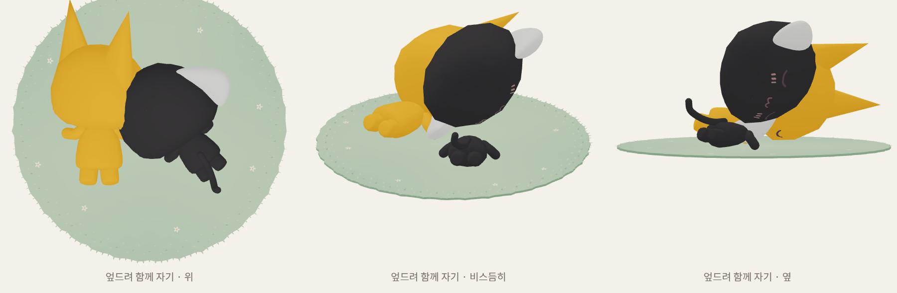
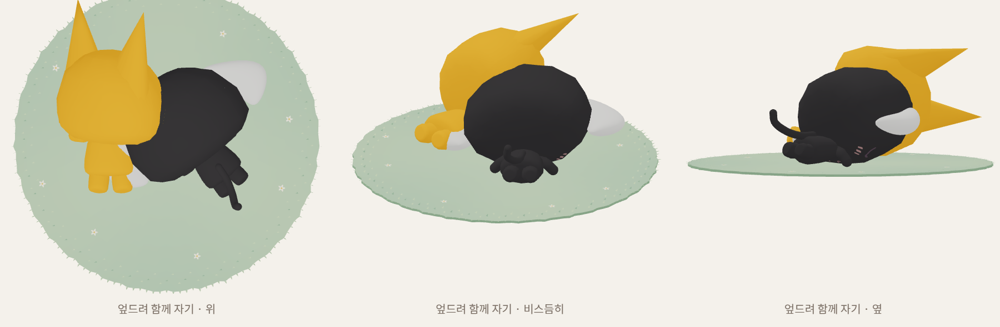
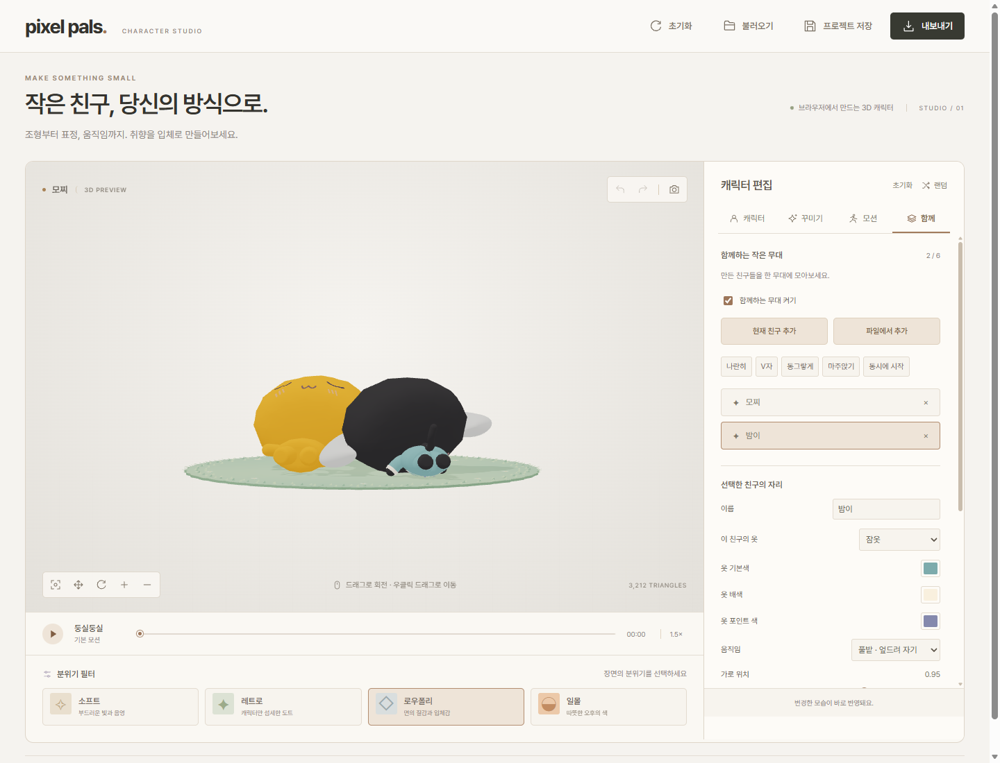

# 함께 자기 목 연결·선택한 친구의 옷 변경

2026-10-04, Windows · Node.js · 별도 프로필의 헤드리스 Microsoft Edge에서 확인했습니다. 사용자께서 보내주신 함께 자기의 목 분리 사진을 기준으로, 두 친구의 위치·방향·크기를 처음 설정한 상태를 재현했습니다.

## 함께 자기에서 목이 벌어지는 원인과 수정

함께 무대의 부모 그룹에 위치·회전·크기를 설정한 뒤, 부모의 좌표 갱신보다 자식 리그의 수면 보정 계산이 먼저 실행됐습니다. 계산 중 일부 본의 좌표만 새 위치로 바뀌면서 머리 표면과 목의 좌표가 다른 기준으로 측정됐습니다. 단독 대자로 자기의 목 보정값은 0.1528803이었지만 처음 배치한 함께 무대에서는 0으로 저장되는 실패를 자동 검사로 재현했습니다.

수면 본을 갱신하기 전에 부모까지 좌표를 갱신하고, 그 뒤 모든 본과 스킨 메시를 갱신합니다. Three.js의 스킨 메시가 사용하는 `bindMatrixInverse`도 갱신한 뒤 실제 머리 표면을 측정합니다. 일단 저장한 보정값은 위치와 방향을 바꿔도 같은 캐릭터의 수면 자세에 계속 사용할 수 있습니다.

처진 귀 강아지를 엎드린 상태에서 깊게 옆으로 돌리면 귀가 볼보다 아래에 닿아서 머리 전체가 올라가는 별도의 문제도 확인했습니다. 이 강아지의 엎드린 머리 회전을 완만하게 조정해 볼이 낮게 놓이고 목과 몸이 연결되도록 했습니다. 일반 자세의 귀 조형이나 비율은 바꾸지 않았습니다.

수정 전 대자로 함께 자기:

수정 후 대자로 함께 자기:

수정 전 엎드려 함께 자기:

수정 후 엎드려 함께 자기:

## 함께하기에서 옷 바로 변경

함께 탭에서 친구를 선택하면 **이 친구의 옷** 선택란과 기본색·배색·포인트 색이 표시됩니다. 옷 없음과 18종 의상을 제공합니다. 변경은 선택한 친구의 실제 모델에 즉시 적용하고, 그 친구의 현재 모션 시간·자리·방향·크기·속도를 유지합니다. 편집 중인 기본 캐릭터와 다른 친구의 설정은 유지합니다.

새 의상 모델을 무대에 붙인 즉시 현재 모션을 적용하므로, 일시 정지 중에도 서 있는 기본 자세로 잠깐 바뀌지 않습니다. 색만 바꿀 때는 지오메트리를 재생성하지 않고 실제 의상 재질의 색을 바꿉니다. 프로젝트 저장·불러오기와 함께 GIF 촬영에도 선택한 의상과 색을 담습니다.

## 확인한 조건과 결과

- 전체 자동 검사 **75개 통과**. 이전 73개와 새 수면 무대·강아지 연결 검사 2개입니다.
- 수면 2종, 고양이·강아지·토끼의 머리·몸·옷 조건 3개, 무대 배치 4개, 시간 4개로 96개 자세를 검사했습니다. 부모 그룹을 먼저 갱신하지 않은 최초 배치와 재생 중 위치·방향 변경을 포함합니다. 단독과 함께 무대의 보정값 최대 차이는 4.441 × 10⁻¹⁶입니다.
- 처진 귀 강아지의 수면 2종 × 체형·귀 크기 5개 × 의상 5개 × 25시점, 총 1,250개 조건에서 실제 머리 삼각형에 대한 광선으로 목 시작점이 가려지는지 확인했습니다.
- 두 친구의 대자로·엎드려 자기, 위·비스듬한 각도·옆에서 수정 전 6장과 수정 후 6장을 실제 렌더했습니다.
- 실제 UI에서 잠옷·쓴 후드티·우주복·야구점퍼·옷 없음으로 교체하고, 선택하지 않은 친구와 기본 편집 캐릭터의 설정이 그대로인지 검사했습니다. 일시 정지한 모션 시간도 그대로입니다.
- 실제 재질이 선택한 색으로 바뀌는지, 서로 다른 수면 모션에서 두 목 연결이 유지되는지, 저장·불러오기 후 선택란·옷·색·모션이 복원되는지 검사했습니다.
- 함께 GIF를 실제 기록하고 디코딩했습니다. 540 × 359px, 12프레임, 첫·끝 프레임 변화 픽셀 1,586개입니다. 해당 브라우저 검사에서 예외는 0개입니다. [UI 검사 원자료](studio-clothing-sleep-results.json).

원인과 수치는 이 프로젝트의 실제 리그·메시·브라우저 재현으로 확인한 결과입니다. 위 검사 조건 밖의 임의 외부 모션이나 친구끼리의 전체 충돌 검사 결과를 의미하지 않습니다.
