# 풀밭 수면 · 생크림 · 디저트 발판 · 아이스크림 · 잠옷모자 전환

2026-10-04 로컬 수정본을 실제 Edge/WebGL에서 검사했습니다. 아래 이미지는 프로그램의 실제 메시와 조명으로 렌더한 결과입니다.

## 추가한 기능

- 풀밭에서 대자로 자기와 엎드려 자기. 수면에서만 머리와 몸의 지지 높이를 각각 맞춰 몸을 풀밭에 내려놓습니다. 원래 표정 설정은 유지하며 수면 중에만 감은 눈을 사용합니다. 함께 무대에서는 하나의 원형 풀밭을 공유합니다.
- 아이스크림 모션. 머리가 스쿱이 되고 두 손이 와플 콘 가장자리에 걸립니다. 콘에는 두 방향의 실제 입체 격자와 테두리가 있습니다. 다른 모션으로 바꾸거나 모델을 저장하면 원래 몸·옷·꼬리가 복원됩니다.
- 머리 위 생크림 4종: 기본, 딸기, 체리, 초콜릿. 파이핑의 능선·과일·씨·꼭지·초콜릿 조각은 실제 메시입니다. 색상과 소품 위치를 조절할 수 있습니다.
- 발판 20종. 케이크: 딸기/초콜릿/복숭아/블루베리, 푸딩: 커스터드/초콜릿/딸기/말차, 롤케이크: 딸기/초콜릿/말차/바닐라, 카스테라: 꿀/초콜릿/말차/딸기, 타르트: 딸기/블루베리/사과/초콜릿. 층·잼·단면 나선·빵의 기공·구운 껍질·타르트 홈·토핑을 종류에 맞춰 만들었습니다.
- 발판의 기본 높이는 1.50배이며 0.80–1.90배로 조절합니다. 가로 크기는 0.70–1.50배입니다. 몸체 높이를 바꾸되 접시는 얇게 유지하고, 토핑의 윗부분은 크기를 유지하며 함께 올라갑니다. 캐릭터 지지 높이도 같이 바뀝니다.

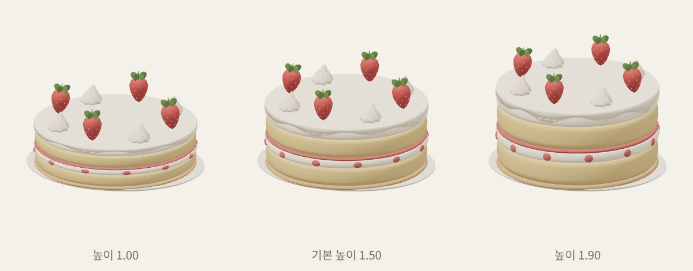

## 잠옷모자 오류의 재현과 수정

우주복을 생성한 다음 잠옷모자를 다시 생성할 때, 캐시가 작은 방울의 위치만 저장하고 크기·회전을 저장하지 않았습니다. 다시 불러온 방울은 0.07 대신 1.00 크기로 생성되었습니다. 머리 배율 1.10에서 방울 지름이 2.20으로 커졌습니다. 캐시에 크기와 쿼터니언을 보존해 지름이 0.154가 되도록 수정했습니다. 실제 UI에서 우주복 선택 후 모자 켜기/끄기를 3회 반복했고 의상이 우주복으로 유지되는지도 확인했습니다.

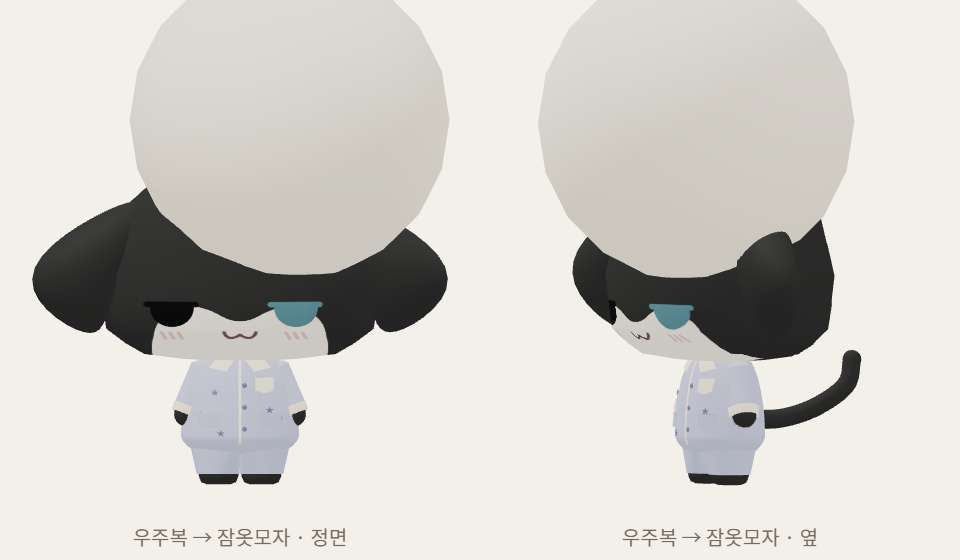
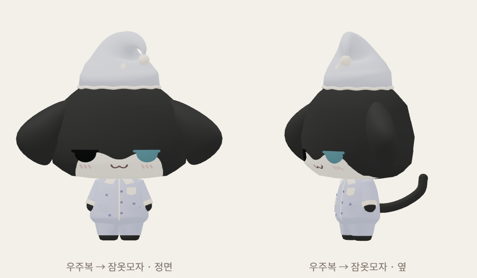

## 실제 렌더

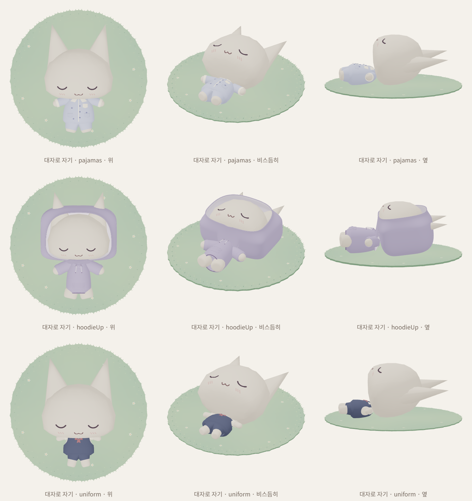
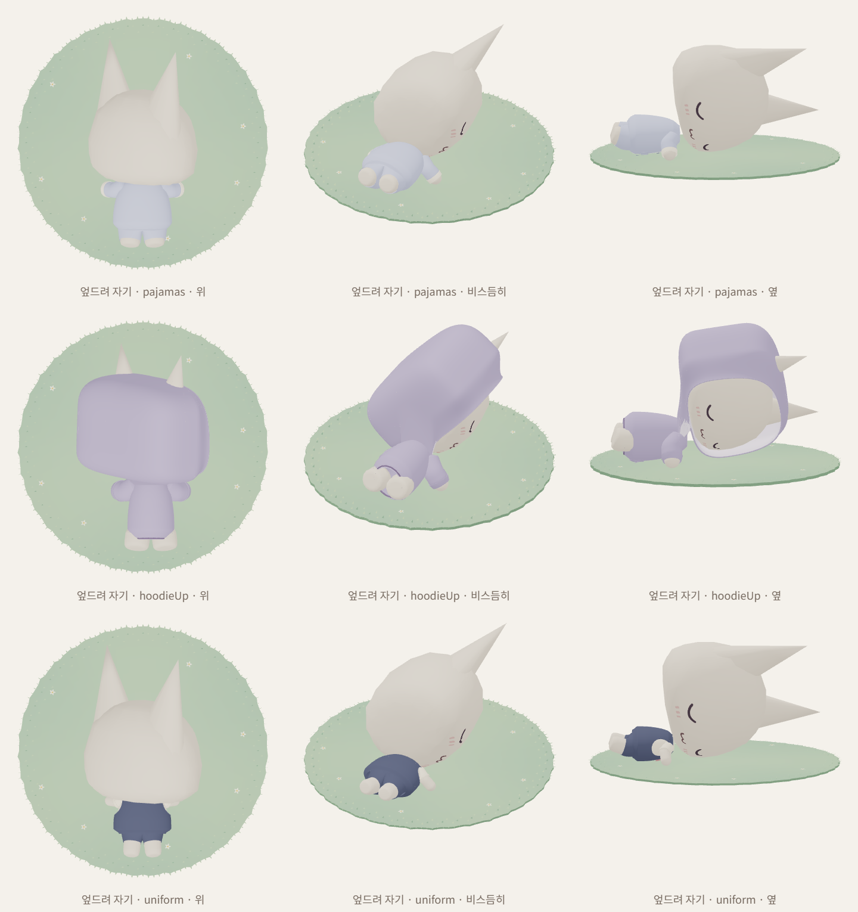
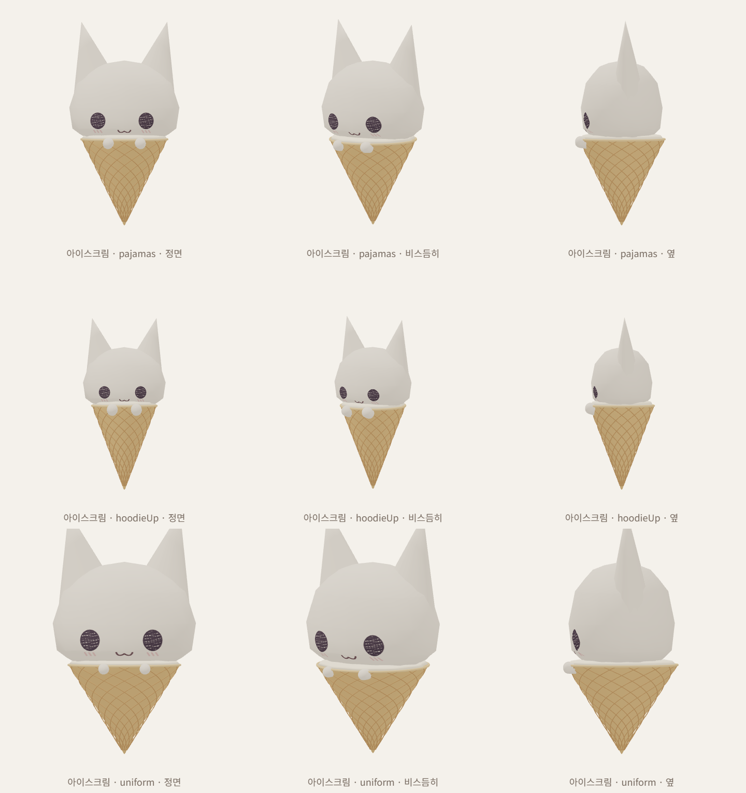
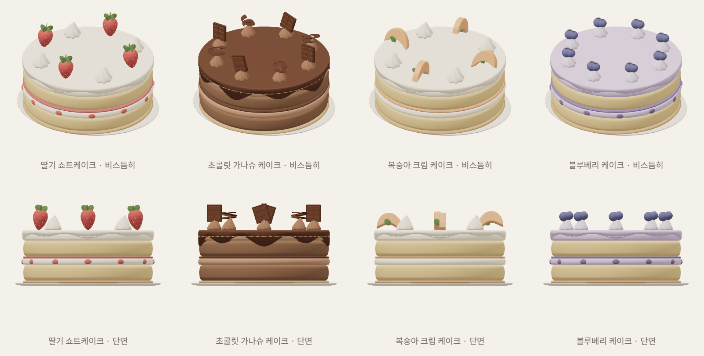
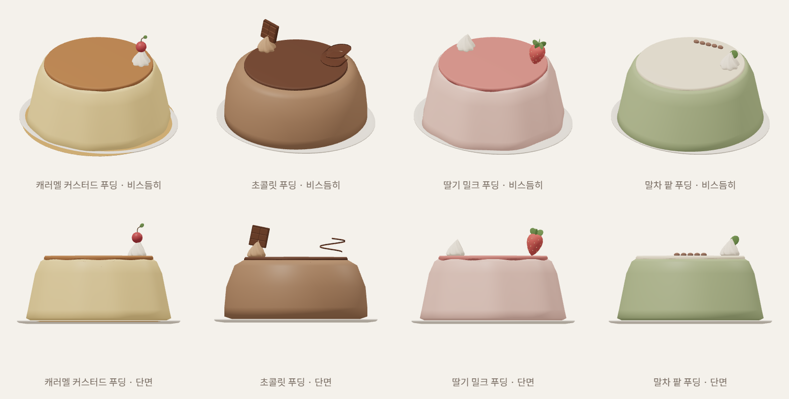
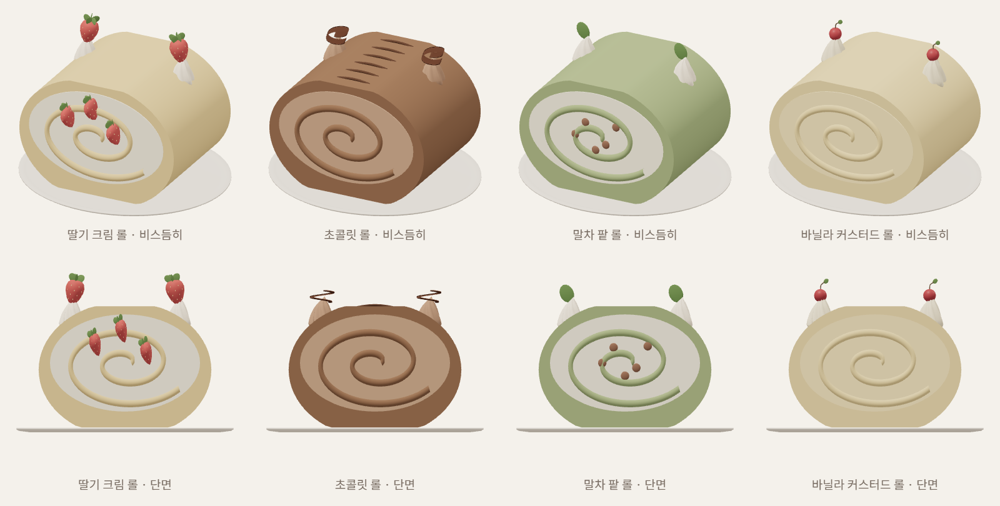
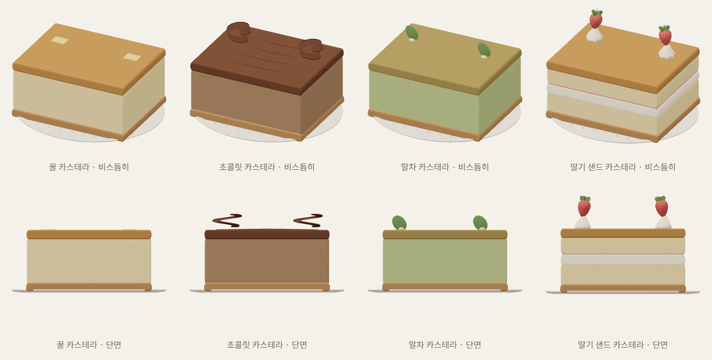
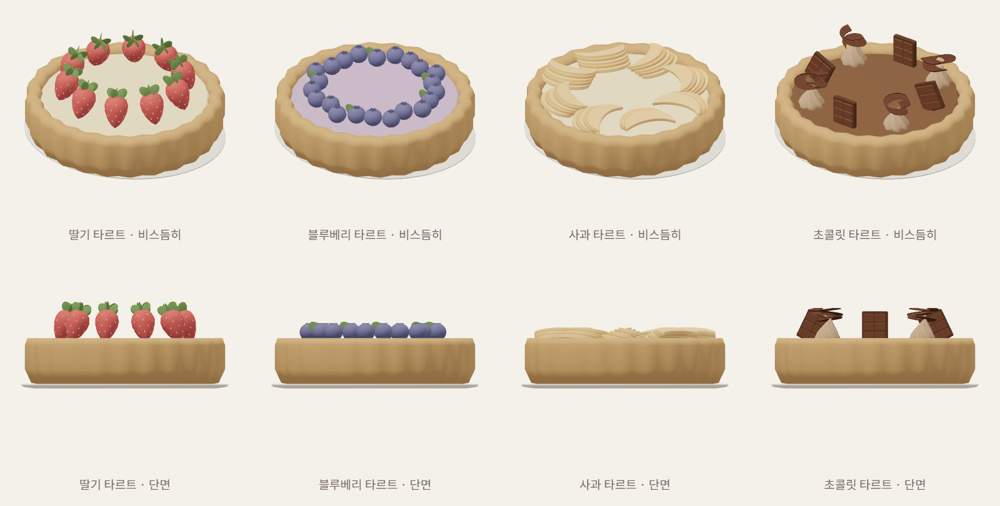
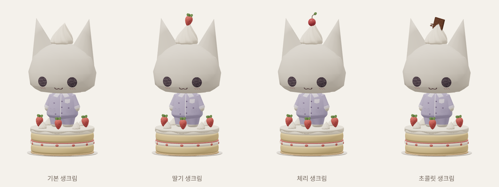
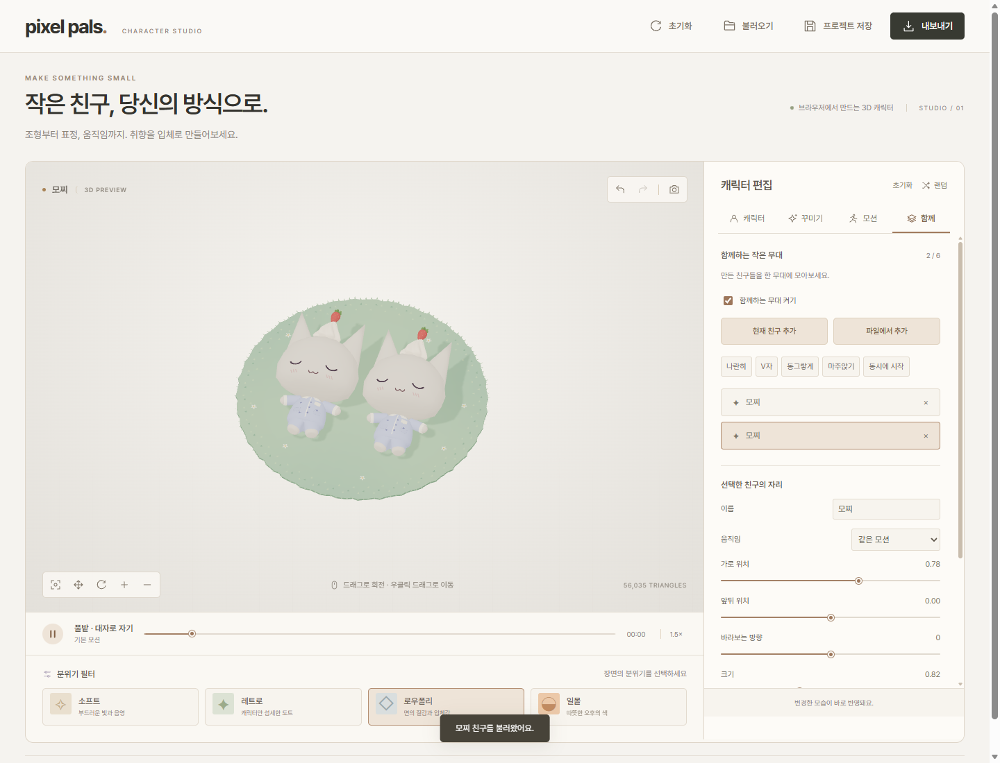

## 검사 결과와 범위

전체 Node 자동 검사 70개 통과. 소품 생성 시 머리 생크림이 중복되지 않도록 수정한 뒤 관련 11개 검사도 다시 통과했습니다. 신규 검사 파일 `tests/sleep-dessert.test.mjs`는 수면 중 바닥·풀밭 범위, 6초 루프, 표정과 꼬리 복원, 아이스크림 두 손의 접촉, 의상·몸 메시의 정확한 복원, 촬영 소품의 모델 내보내기 제외, 디저트 20종의 지지면·접시·높이 변경, PMX 파싱과 모자 캐시를 검사합니다.

실제 브라우저에서 수면 18시점, 아이스크림 9시점, 디저트와 생크림 44시점, 높이 비교 3시점을 렌더했습니다. 잠옷모자는 수정 전후 각각 정면·측면을 확인했습니다. 새 모션 3개 모두 540×359, 12프레임 GIF로 촬영한 뒤 디코딩했고 첫 프레임과 마지막 프레임에 움직임이 있습니다. 발판 높이 1.85, 생크림, 발판 종류, 모션은 프로젝트 저장·불러오기에서 유지됩니다. 함께 수면의 원형 풀밭 1개, 기존 단독·함께 피크닉 GIF, 의상 색상 변경과 프로젝트 복원도 확인했습니다. 브라우저 예외 0개.

디저트 5개 계열을 각각 GLB로 내보내 22개 관절, GLB v2 헤더와 실제 모델 정점 수 일치를 확인했습니다. 대표 5종은 독립 PMX 파서로도 확인했습니다. 수면의 풀밭과 아이스크림 콘은 PNG/GIF에 담기는 모션 소품이며 GLB/PMX에는 포함되지 않습니다. 선택한 디저트 발판과 생크림은 모델 내보내기에 포함됩니다. 외부 3D 도구에서의 재생 호환성은 별도 확인이 필요합니다.

워커와 메인 스레드의 실제 미리보기 15개를 비교해 모든 픽셀 채널 차이가 0인 것을 확인했습니다. 워커 미지원 대체 경로도 통과했습니다. 작은 씨·기공의 메시 밀도를 줄이고 재질별로 합쳤습니다. 딸기 타르트의 정점 수는 초기 작업본 287,088개에서 76,560개로 줄었습니다. 기본 딸기 케이크·생크림 캐릭터의 120프레임 측정에서 렌더 제출 CPU 중앙값 0.10ms, 95백분위 0.30ms, draw call 19회였습니다. 이는 GPU 완료 시간이나 지속 FPS 측정이 아니며, 모든 기기에서의 성능 향상을 의미하지 않습니다.

검사 원자료는 개발 폴더 `tests/artifacts/`에 저장합니다. 아래 결과 JSON은 이 문서와 함께 패키지에 포함합니다.

- [UI/GIF 결과](sleep-dessert-ui-results.json)
- [GLB·렌더 제출 시간](dessert-height-export-results.json)

## 조형 참고

사용자 그림을 수면과 아이스크림의 구도 기준으로 삼았습니다. 실제 제과 형태는 [Moncher](https://www.mon-cher.com/)의 크림 롤 단면, [Fukusaya](https://www.fukusaya.co.jp/index.html)의 카스테라, [Pierre Hermé](https://www.pierreherme.com/en/pastries.html)의 층과 타르트 장식, [Marlowe](https://shop.marlowe.co.jp/select_item.phtml?CATE3_ID=177&search_type=init&tag_id=)의 커스터드 푸딩을 확인했습니다. 제품의 사진·로고·모델은 배포 에셋에 포함하지 않았습니다.
