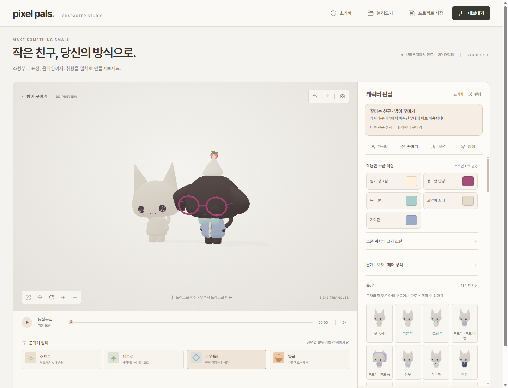
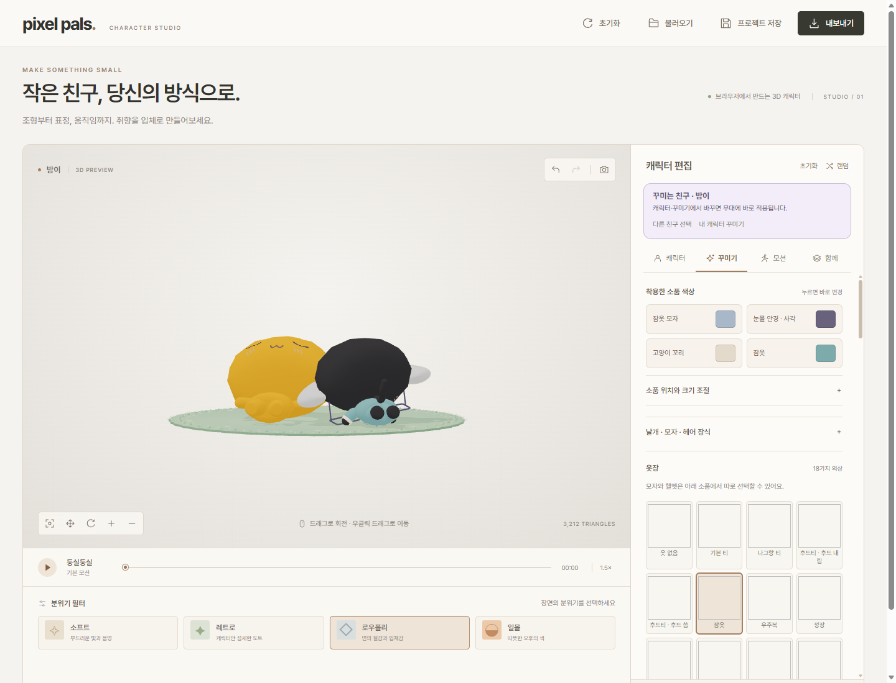

# 함께 선택한 친구를 기존 편집 화면에서 꾸미기

2026-10-04, Windows·Node.js·별도 프로필의 Microsoft Edge에서 확인했습니다.

## 바뀐 동작

함께 무대에서 친구를 선택하면 기존 **캐릭터·꾸미기** 탭 전체가 그 친구의 설정을 표시하고 수정합니다. 옷장, 액세서리 선택·해제, 소품 색·위치·크기, 디저트 발판, 종·체형·표정·얼굴 장식 등 기존 편집 기능을 그대로 사용합니다. 친구를 다시 추가하거나 적용 버튼을 누를 필요가 없습니다.

1. **함께**에서 친구를 선택합니다.
2. **캐릭터** 또는 **꾸미기** 탭을 엽니다. **이 친구 꾸미기**는 꾸미기 탭으로 가는 바로가기입니다.
3. 평소처럼 설정을 바꾸면 선택한 친구에게 반영됩니다. 위쪽 **꾸미는 친구** 표시에서 편집 대상을 확인할 수 있습니다.

자리·방향·전체 크기·개별 모션·속도와 다른 친구의 설정은 유지합니다. **다른 친구 선택**으로 대상을 바꾸면 해당 친구의 설정과 실행 취소 기록을 표시합니다. **내 캐릭터 꾸미기**로 돌아가면 함께 미리보기를 끄고 원래 캐릭터를 표시하며, 친구들의 배치는 보관합니다. 함께 미리보기가 꺼져 있어도 친구를 선택하면 그 친구가 있는 무대를 다시 표시합니다.

기본 모션 재생·배경·필터는 공용 무대 설정입니다. 친구별 모션은 함께 탭의 움직임 설정을 사용합니다. 프로젝트 저장은 원래 캐릭터와 함께 무대의 친구들을 각각 저장합니다. GLB·PMX는 현재 꾸미는 친구를 내보내며, 내보내기 때문에 화면의 수면 자세나 배치가 바뀌지 않도록 별도 모델에서 생성합니다.

## 실제 편집 화면

오른쪽 친구만 가디건·둥근 안경·목 리본·딸기 생크림으로 꾸민 화면입니다. 안경과 옷 색, 안경 위치·크기, 표정·머리 비율도 기존 입력에서 바꿨습니다. 왼쪽 친구와 원래 캐릭터의 설정은 보존됐습니다.

수면 중 잠옷·눈물 안경·잠옷 모자·소품 위치와 머리 비율을 바꾼 화면입니다. 두 친구의 목 연결을 실제 스킨 메시 교차 검사로 확인했습니다.

## 검증 근거

- 전체 자동 검사 **79개 통과**. 새 편집 대상·공용 설정 구분, 친구별 실행 취소·다시 실행, 중첩 소품 위치 기록과 이력 제한 검사 4개를 포함합니다.
- 실제 브라우저에서 옷·안경·리본·생크림, 소품 색·위치·크기, 이름·눈·입·머리·몸 비율을 변경했습니다. 설정값뿐 아니라 선택한 친구의 실제 재질과 소품 변환을 확인했습니다.
- 친구 변경 시 입력과 실행 취소 기록 교체, 친구별 편집 격리, 편집 직후 다른 친구를 선택해도 예약된 모델 갱신 대상 유지, 선택 친구 삭제, 소품 모두 해제·실행 취소를 확인했습니다.
- 자리·방향·크기·개별 모션·속도, 일시 정지 시간과 카메라 유지, 원래 캐릭터 설정 보존, 프로젝트 저장·재불러오기를 확인했습니다.
- GLB의 캐릭터 설정과 PMX ZIP의 모델·프로젝트를 읽어 선택한 친구가 저장됐는지 확인했습니다. 화면의 본 위치·회전이 내보내기 전후 동일했습니다.
- 수면 중 의상 5종 변경과 소품·색·위치·머리 비율 변경 후 두 목 연결을 확인했습니다. 함께 GIF를 생성·디코딩해 **540×359, 12프레임**, 첫·마지막 프레임의 변화 **1,840픽셀**을 확인했습니다.
- 390px 모바일 화면에서 편집 대상 표시가 가로로 넘치지 않는지 확인했습니다. 두 브라우저 검사에서 처리되지 않은 JavaScript 예외는 **0개**였습니다.

브라우저 결과: [전체 편집 원자료](studio-full-editor-results.json), [수면·함께 GIF 원자료](studio-full-editor-sleep-results.json). 모바일 화면: [실제 캡처](studio-full-editor-mobile-20261004.png).

검사 코드: `tests/studio-editor.test.mjs`, `tests/studio-editor-review.mjs`, `tests/studio-clothing-sleep-review.mjs`. 모델을 바꾸는 입력은 연속 입력을 합쳐 갱신하며, 저장·내보내기 전에 예약된 갱신을 완료합니다. 새로운 FPS 개선 수치는 측정하지 않았습니다.
